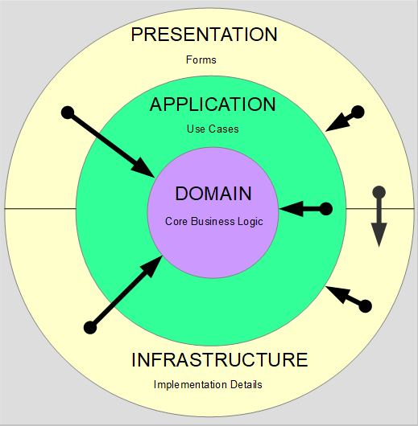

# ToDoCleanArchitectureWinForms

## Clean Architecture

## ✅ Where You Can Use Clean Architecture
	1. Web Applications
		Backend APIs (e.g., REST, GraphQL)
		MVC-based web apps
		Works well in ASP.NET Core, Node.js, or Java Spring Boot projects

	2. Desktop Applications
		WPF, WinForms (.NET)
		JavaFX, Swing (Java)
		Electron (JavaScript)

	3. Mobile Applications
		Android (Kotlin/Java with Clean Architecture)
		iOS (Swift)
		Cross-platform (Flutter, React Native, MAUI)

	4. Microservices
		Each microservice can follow Clean Architecture to ensure decoupling and testability.

	5. Enterprise Applications
		Business-critical systems with complex business rules
		Applications that require long-term maintainability

	6. Game Development (less common, but possible)
		Particularly in logic-heavy games where domain rules are complex

	7. IoT Backends or Data Processing Systems
		Any system that involves complex use cases, workflows, and integrations

## 🚫 When NOT to Use Clean Architecture
	1. For tiny apps or quick prototypes — it might be overkill

	2. Projects with low complexity and short lifespan

	3. When performance-critical constraints favor minimal architecture layers

## 🧱 Clean Architecture Layer Mapping

## Clean Architecture in .NET WinForms

### 🗂️ Example Project Structure:

